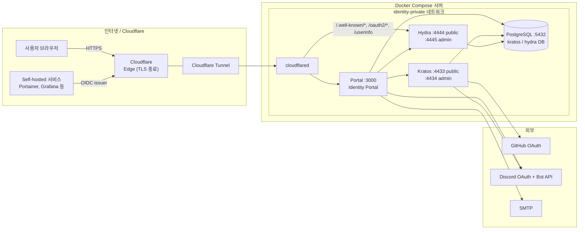
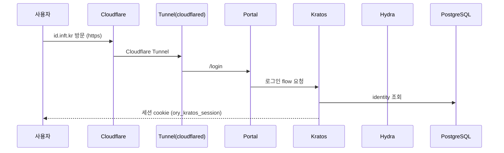
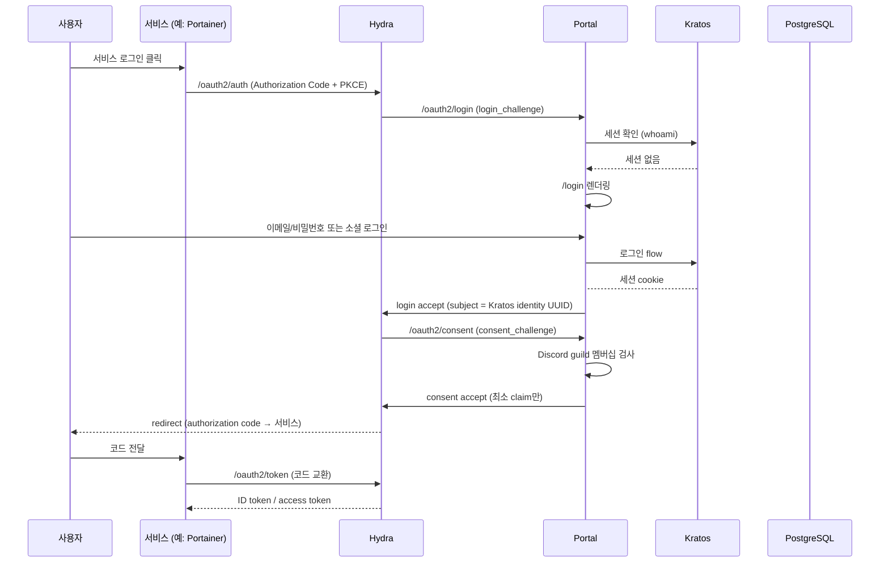
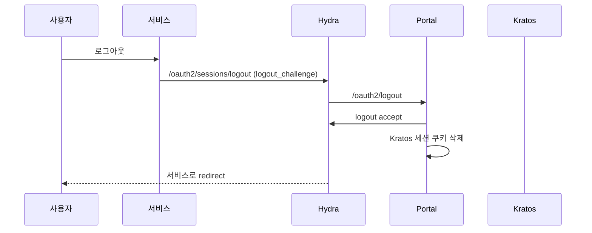

# Infiniteteam 통합 인증 시스템

Infiniteteam 사내 통합 인증(SSO) 시스템입니다. Ory Kratos + Ory Hydra + PostgreSQL + Cloudflare Tunnel(cloudflared) + 자체 Identity Portal 구조로 구축되어 있으며, 여러 self-hosted 서비스가 `auth.inft.kr`을 OIDC issuer로 사용할 수 있게 합니다.

## 아키텍처



## 구성 요소

| 구성 요소 | 역할 | 공개 URL | 외부 노출 |
|-----------|------|----------|-----------|
| cloudflared | Cloudflare Tunnel agent, ingress 라우팅 | - | 예 (아웃바운드만) |
| Identity Portal | Hydra login/consent/logout bridge, 로그인 UI | `https://id.inft.kr` | 예 (Tunnel 경유) |
| Kratos | 사용자 identity, 이메일/비밀번호, 소셜 로그인, MFA, 이메일 검증 | 내부 `:4433/:4434` | 아니오 |
| Hydra | OIDC issuer, OAuth 2.0, JWKS, token 발급 | `https://auth.inft.kr` | 예 (Tunnel 경유) |
| PostgreSQL | Kratos/Hydra 영속 데이터 | 내부 `:5432` | 아니오 |

- **Kratos public API**: `https://id.inft.kr/.kratos/`
- **Kratos admin API**: `http://kratos:4434/` (내부 전용)
- **Hydra public/OIDC issuer**: `https://auth.inft.kr`
- **Hydra admin API**: `http://hydra:4445/` (내부 전용)

## 통신 흐름

### 1. 브라우저 로그인 (이메일/비밀번호)



### 2. OIDC SSO 로그인 (서비스가 이용자 요청)



### 3. 로그아웃



## 지원 로그인 방법

| 방법 | 설명 |
|------|------|
| 이메일/비밀번호 | 기본 로그인, 이메일 검증 필수 |
| GitHub OAuth | `github` provider, 최소 scope |
| Discord OAuth | `discord` provider + **지정 서버 구성원 검사** |

### Discord guild 검사 정책
- Discord OAuth 로그인만으로는 내부 서비스 접근이 **승인되지 않습니다**.
- Portal이 Discord Bot API로 사용자의 `discord_id`가 `DISCORD_GUILD_ID` 서버의 구성원인지 확인합니다.
- 서버 비구성원은 **fail closed**로 접근이 거부됩니다.
- Discord API 장애 시에도 거부 처리합니다 (장애를 "멤버임"으로 오판하지 않음).

### 소셜 계정 연결 정책
- **동일 이메일로 자동 병합하지 않습니다.** GitHub/Discord 계정 연결은 로그인된 상태에서 `/settings` 또는 소셜 로그인 후 별도 화면에서만 수행됩니다.
- 소셜 계정 연결 시 **비밀번호 설정을 요구**하여 계정을 안전하게 확정합니다.
- `admin` role은 Discord role만으로 **자동 부여하지 않습니다**. 수동 승인(`ADMIN_DISCORD_ROLES` 또는 identity `role: admin`)으로만 부여됩니다.

## Token 정보

- **Flow**: Authorization Code + PKCE
- **Redirect URI**: 각 클라이언트별 정확한 HTTPS callback만 allowlist에 등록
- **Scopes**: `openid`, `profile`, `email`, `groups`, `role`
- **Subject**: Kratos identity UUID (`sub`), 이메일 아님
- **Claim 최소화**: 클라이언트가 요청한 scope에 대해서만 claim 발급
  - `email` scope: `email`, `email_verified`
  - `profile` scope: `name`, `preferred_username`
  - `groups` scope: `groups` (Discord server ID, `discord:<role_id>`)
  - `role` scope: `role` (`user` / `admin`)

## 구조

```
auth/
├── compose.yaml                  # production Compose
├── compose.staging.yaml          # staging 오버라이드
├── .env.example                  # 환경 변수 템플릿
├── cloudflared/
│   ├── config.yml                # Tunnel ingress 라우팅 (Caddy 대체)
│   ├── credentials.json          # Tunnel secret (Git 제외, 권한 600)
│   └── credentials.json.example  # 형식 예시
├── config/
│   ├── hydra/
│   │   └── hydra.yml             # OIDC issuer, login/consent URL, PKCE
│   └── kratos/
│       ├── kratos.yml            # self-service flows, 이메일, MFA
│       ├── identity.schema.json  # email/name/groups/role 스키마
│       ├── oidc.github.jsonnet   # GitHub claim 매퍼
│       ├── oidc.discord.jsonnet  # Discord claim 매퍼
│       └── templates/            # 이메일 템플릿
├── portal/                       # Identity Portal
│   ├── Dockerfile
│   ├── package.json
│   └── src/server.js             # Hydra bridge + UI
├── scripts/
│   ├── generate-secrets.sh       # secret 자동 생성
│   ├── register-portainer.sh     # Portainer OIDC client 등록
│   ├── migrate.sh                # DB 마이그레이션
│   ├── healthcheck.sh            # 서비스 health check
│   ├── backup.sh                 # PostgreSQL 백업
│   └── restore.sh                # PostgreSQL 복구
└── docs/
    ├── architecture.md           # (본 문서의 상세 확장)
    ├── deployment.md             # 배포 절차
    └── operations.md             # 운영 / 백업 / runbook
```

## 요구 사항

- Ubuntu 24.04 LTS + (ARM64/aarch64 권장)
- Docker Engine 29.x 이상, Docker Compose v2.x 이상
- **Cloudflare Tunnel** (cloudflared) 사용 — 외부 인바운드 포트 불필요 (80/443 닫기 가능)
- Cloudflare: `inft.kr` 존에서 `id.inft.kr`·`auth.inft.kr` → **CNAME `<tunnel-uuid>.cfargotunnel.com` (Proxied)**
  - 더 이상 서버 공인 IP를 직접 노출하지 않음

## 사용 설정 버전 (고정 tag)

`latest` 금지. 아래 tag는 ARM64에서 동작이 검증되었습니다.

| 이미지 | 버전 |
|--------|------|
| `oryd/kratos` | `v26.2.0` |
| `oryd/hydra` | `v26.2.0` |
| `postgres` | `16` |
| `cloudflare/cloudflared` | `2026.8.2` |
| `node` | `20-alpine` |

## 빠른 시작

배포 전 단계별 안내는 [docs/deployment.md](docs/deployment.md)를 참고하세요.

```bash
# 1. clone & secret 생성
git clone git@github.com:InfiniteTeam/auth.git && cd auth
./scripts/generate-secrets.sh
# .env 편집: GITHUB_*, DISCORD_*, SMTP_* 값 입력
nano .env

# 2. DB migration
docker compose config --quiet && echo OK
docker compose up -d postgres
./scripts/migrate.sh

# 3. 전체 기동
docker compose up -d --build
docker compose ps
./scripts/healthcheck.sh

# 4. (최초 1회) Portainer OIDC client 등록
./scripts/register-portainer.sh
```

## Portainer OIDC 연동

Portainer UI → **Settings → Authentication → OAuth**에서:

| 설정 | 값 |
|------|-----|
| Client ID | `register-portainer.sh`의 출력 `client_id` |
| Client Secret | 동일 출력 `client_secret` |
| Authorization URL | `https://auth.inft.kr/oauth2/auth` |
| Access Token URL | `https://auth.inft.kr/oauth2/token` |
| Resource URL | `https://auth.inft.kr/oauth2/userinfo` |
| Redirect URL | `http://localhost:9443/auth/callback` (환경에 맞게) |
| User Identifier | `email` 또는 `sub` |
| Default Role | `normal user` |

## 검증 체크리스트

- [ ] 잘못된 redirect URI가 Hydra에서 거부된다.
- [ ] PKCE 없이 public client token을 얻을 수 없다.
- [ ] 만료된 Kratos 세션으로 Hydra login을 승인할 수 없다.
- [ ] Discord 서버 비구성원이 내부 서비스 token을 얻을 수 없다.
- [ ] GitHub/Discord 계정을 로그인된 상태에서만 연결할 수 있다.
- [ ] 동일 이메일의 다른 소셜 계정이 자동 병합되지 않는다.
- [ ] 로그/브라우저에 token·secret이 노출되지 않는다.
- [ ] DB restore 후 이메일 로그인과 OIDC 로그인이 모두 성공한다.

## 보안 요약

- 모든 admin API(Postgres 5432, Kratos 4434, Hydra 4445)는 **내부 네트워크 전용**
- **외부 공개 포트 없음** — Cloudflare Tunnel(cloudflared)이 아웃바운드로만 연결, 80/443 인바운드 불필요
- Tunnel ingress에서 `auth.inft.kr/admin/*` → **403 차단**
- Portal helmet으로 HSTS/nosniff/X-Frame-Options(DENY)/Referrer-Policy 적용 (Next.js 이전 시 headers()로 이관)
- 소셜 병합 금지, Discord guild fail-closed, `admin` 수동 승인
- Authorization Code + PKCE, redirect allowlist, 최소 claim
- 브라우저 세션 쿠키는 `HttpOnly; Secure; SameSite=Lax`

## 참고 문서

- [docs/architecture.md](docs/architecture.md) — 통신 구조, claim, 구성요소 상세
- [docs/deployment.md](docs/deployment.md) — staging → production 배포 절차
- [docs/operations.md](docs/operations.md) — 백업/복구, secret rotation, incident runbook
- [Notion: 인증시스템 도입](https://app.notion.com/p/4abdfa81ac1e82bc8d76011bcec3b2b6)