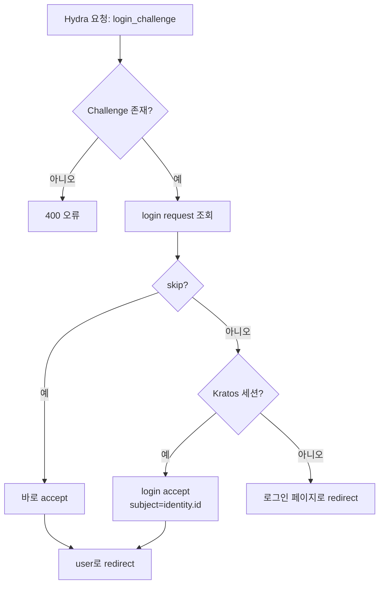
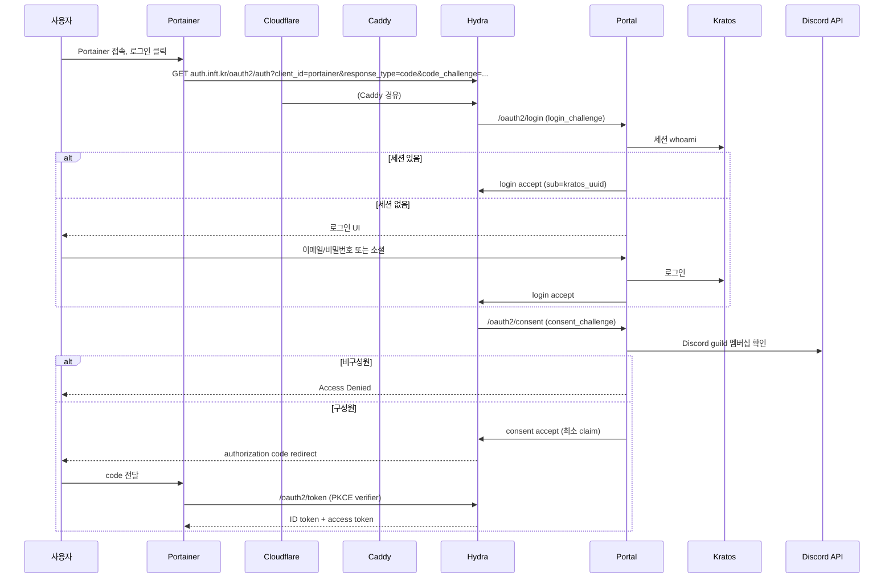

# 아키텍처 상세

## 개요

Infiniteteam 통합 인증은 **Ory Kratos**(신원/로그인)와 **Ory Hydra**(OIDC/토큰)를 하나의 Portainer 같은 self-hosted 서비스가 OIDC issuer로 사용하도록 연결하는 구조입니다. 둘을 직접 붙이지 않고 **Identity Portal**이라는 자체 bridge 서비스가 중간에서 로그인/consent/logout을 처리합니다.

## 배경: 왜 Portal이 필요한가

Kratos는 표준 OIDC provider가 아니어서 다른 서비스에 OIDC token을 직접 발급하지 못합니다. Hydra는 OAuth 2.0/OIDC authorization server지만 사용자 비밀번호를 관리하지 않으며 외부 로그인 provider에 인증을 위임합니다. 즉 **Hydra가 "누가 인증했는지" 알려면 별도 로그인 화면이 필요**하고, 이 화면과 인증 단계를 Kratos 세션과 연결하는 것이 Portal의 핵심 역할입니다.

## 구성 요소와 책임

| 구성 요소 | 외부 노출 | 내부 URL | 책임 |
|-----------|-----------|----------|------|
| Caddy | `:80`, `:443` | - | TLS 종료, reverse proxy, 보안 헤더, admin API 차단 |
| Portal | `id.inft.kr` | `http://portal:3000` | Hydra login/consent/logout bridge, 로그인 UI, Discord guild 검사, claim 생성 |
| Kratos | - | `http://kratos:4433` (public), `http://kratos:4434` (admin) | 신원, 이메일/비밀번호, 소셜 로그인, MFA, 이메일 검증/복구, 브라우저 세션 |
| Hydra | `auth.inft.kr` | `http://hydra:4444` (public), `http://hydra:4445` (admin) | OAuth 2.0/OIDC, JWKS, authorization code, token 발급 |
| PostgreSQL | - | `http://postgres:5432` | Kratos/Hydra 영속 데이터 |

Docker network 경계:
- `edge`: Caddy만 (공개 트래픽 진입점)
- `identity-private` (`internal: true`): Portal, Kratos, Hydra, PostgreSQL

## 도메인 매핑

| 도메인 | 용도 |
|--------|------|
| `id.inft.kr` | Portal + 로그인 UI. Kratos 세션 쿠키 도메인 |
| `auth.inft.kr` | Hydra OIDC issuer 전용 |

`id`와 `auth`를 분리하는 이유는 OIDC discovery URL(`auth.inft.kr/.well-known/openid-configuration`)과 token issuer를 안정적으로 고정하기 위함입니다. Portal을 `id`에, Kratos 세션 쿠키 도메인도 `id`로 두어 session cookie를 Portal이 안전하게 재사용합니다.

## Caddy 라우팅

Caddyfile 요약:

```
id.inft.kr   → reverse_proxy portal:3000                     (로그인/UI 전체)
auth.inft.kr ┬ /.well-known/* → hydra:4444                   (discovery, JWKS)
             ├ /oauth2/*      → hydra:4444                   (auth/token/userinfo)
             ├ /userinfo      → hydra:4444
             ├ /admin/*       → 403 Forbidden                (관리 API 차단)
             └ fallback       → portal:3000                  (login/consent/logout)
```

모든 경로에 HSTS, `X-Content-Type-Options`, `X-Frame-Options`, `Referrer-Policy` 헤더를 적용하고 JSON 로그를 남깁니다.

## Identity 스키마

`config/kratos/identity.schema.json`의 traits:

```json
{
  "email":   { "type": "string", "format": "email" },
  "name":    { "first": "...", "last": "..." },
  "groups":  ["member", "discord:<role_id>", ...],
  "role":    "user" | "admin"
}
```

- `email`은 password identifier이자 recovery/verification 대상입니다.
- `discord_id`/GitHub 토큰 등 민감값은 traits에 저장하지 않습니다.
- Hydra `sub`에는 **이메일이 아닌 Kratos identity UUID**를 사용합니다.
- 개인정보는 token에 필요한 최소 claim만 넣습니다.

## Portal 책임과 Endpoint

Portal(`portal/src/server.js`)은 다음과 같은 역할을 합니다.

| Endpoint | 역할 |
|----------|------|
| `GET /` | 홈 (로그인 여부 표시) |
| `GET/POST /login` | 이메일/비밀번호 로그인, 소셜 로그인 링크 |
| `GET/POST /registration` | 신규 가입 |
| `GET/POST /recovery` | 비밀번호 복구 |
| `GET /settings` | 계정 설정 (identity 정보) |
| `GET /oauth2/login` | Hydra login bridge |
| `GET /oauth2/consent`, `POST /oauth2/consent` | Hydra consent bridge |
| `GET /oauth2/logout` | Hydra logout bridge |
| `GET /oidc/start/:provider` | 소셜 로그인 시작 |
| `GET /oidc/callback` | 소셜 OAuth callback |
| `GET/POST /oidc/complete` | 소셜 계정 연결/가입 완료 |
| `GET /health` | health check |

### Hydra login bridge (`/oauth2/login`)



- Kratos 세션 쿠키(`ory_kratos_session`)를 그대로 Portal이 읽어 whoami로 검증합니다.
- 세션이 없으면 로그인 페이지로 보냅니다.
- `skip=true`인 경우(재로그인) subject를 그대로 accept합니다.

### Hydra consent bridge (`/oauth2/consent`)

```mermaid
flowchart TD
    A[Hydra 요청: consent_challenge] --> B{Challenge 존재?}
    B -- 아니오 --> ERR1[오류 redirect]
    B -- 예 --> C[consent request 조회]
    C --> D[identity 로드 (admin API)]
    D --> E[Discord guild 멤버십 검사]
    E --> F{구성원?}
    F -- 아니오 --> ACCESS_DENIED[거부 화면 / reject]
    F -- 예 --> G[최소 claim 생성]
    G --> H[consent accept]
    H --> I[user로 redirect]
```

consent 단계에서 **Discord 지정 서버 구성원 여부를 반드시 검사**합니다. 연결된 Discord 계정이 없거나, 서버 비구성원이거나, Discord API 장애(strict)면 token 발급을 거부합니다.

### Discord guild 검사 로직

`checkDiscordGuildMembership()`은 Discord Bot API를 사용합니다.

```
GET https://discord.com/api/v10/guilds/{DISCORD_GUILD_ID}/members/{discord_id}
Authorization: Bot {DISCORD_BOT_TOKEN}
```

- HTTP 200 → 구성원. `roles` 배열 반환.
- HTTP 404 → 비구성원.
- 그 외 오류 → **거부 처리** (fail closed).

### Logout bridge (`/oauth2/logout`)

- Hydra가 `logout_challenge`와 함께 Portal `/oauth2/logout` 호출.
- Portal이 logout request 조회 후 accept하고, Kratos 세션 쿠키를 삭제.
- 결과 redirect URL로 이동.

## Claim 생성 규칙

`buildConsentSession()`이 클라이언트가 요청한 scope에 따라 최소 claim만 생성합니다.

| Scope | ID token / access token claim |
|-------|-------------------------------|
| `openid` | `sub` (Kratos UUID) |
| `email` | `email`, `email_verified` (verifiable_addresses 기반) |
| `profile` | `name` (first+last), `preferred_username` |
| `groups` | `groups`: `[<guild_id>, "discord:<role_id>", ...]` |
| `role` | `role`: `user` \| `admin` |

### role 계산 규칙
- identity `traits.role === "admin"` → `admin`
- `ADMIN_DISCORD_ROLES`에 포함된 Discord role을 가진 경우 → `admin`
- 그 외 → `user`
- **Discord role만으로 자동 부여하지 않음**: `ADMIN_DISCORD_ROLES` 환경변수에 명시적으로 나열한 role만 인정됩니다.

## 소셜 로그인 상세

### GitHub
- provider: `github`, scopes: `openid email profile`
- callback: `https://id.inft.kr/oidc/callback?provider=github`
- claim 매퍼(`oidc.github.jsonnet`)가 `email`, `name` → traits로 변환.

### Discord
- provider: `discord`, scopes: `openid email identify`
- callback: `https://id.inft.kr/oidc/callback?provider=discord`
- claim 매퍼(`oidc.discord.jsonnet`)가 `email`, `global_name` → traits로 변환.
- Discord 사용자가 `email` 미제공 시 `username@discord.local` 처리.

### 계정 연결 정책
- 동일 이메일만으로 **자동 병합하지 않습니다.**
- 로그인된 사용자가 소셜 로그인하면 `/oidc/callback`에서 **로그인 상태면 그대로 연결**, 아니면 `/oidc/complete`로 보내 **비밀번호 설정 후 신규 가입 + 연결**을 수행합니다.
- `/oidc/complete` 화면에서 사용자가 비밀번호를 설정해야 계정이 확정됩니다. (병합이 아니라 별도 연결)

## OIDC 발급 시나리오 (Portainer 예시)



## PKCE

- Hydra Configuration: `oauth2.pkce.enforced: true` 이 구성에서는 Hydra 설정에 PKCE 강제를 기본으로 합니다.
- 모든 browser/public client는 `code_challenge`/`code_verifier`를 사용해야 합니다.
- confidential client(서버 측보다 TLS로 보호되는)는 `client_secret_post` + PKCE를 함께 사용해도 무방합니다.

## 보안 경계 요약

- 외부 공개 포트: **80, 443뿐** (Caddy만 publish)
- Kratos admin(4434), Hydra admin(4445), PostgreSQL(5432)은 **내부 network 전용**
- `auth.inft.kr/admin/*` → Caddy에서 403 차단
- 소셜 병합 금지, Discord fail-closed, `admin` 수동 승인
- 브라우저 세션 쿠키: `HttpOnly; Secure; SameSite=Lax`, `secure: true`
- JSON 구조화 로그 (token/secret 미기록)
- HSTS / CSP / X-Content-Type-Options / Referrer-Policy 적용

## 첫 연동 서비스: Portainer

자세한 설정은 [../README.md](../README.md)의 **Portainer OIDC 연동** 참고.